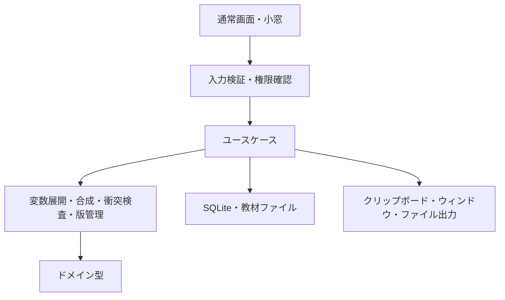

# 技術構成

状態：レビュー用初稿 / 2026-10-04。文書内のAPI名はアプリ内契約の提案であり、既存ライブラリAPIとは区別する。

## 1. 技術選択

初期案はTauri v2＋Rust＋React／TypeScript＋Vite＋SQLite（rusqlite）。CSSは小さな製品用トークンを先に定義し、TailwindやUIライブラリは必須としない。
既存の技術案を維持し、純粋な合成・検査ロジックをRustへ置く。macOSの呼出し・復帰・IMEを実機で先に確かめる。
Tauriで期待する操作体験が成立しない場合は、最小のOS連携かネイティブUIへの変更を比較してから選ぶ。フレームワーク維持を優先してUXを弱めない。
バージョンは実装開始時に一次資料で確認してlockfileへ固定する。メモリ・速度・費用は未測定。

当初資料のTauri v2に対する`allowlist`指定は改め、capabilities／permissionsを用いる。capabilitiesはWebViewへのAPI公開境界であり、Rustの任意の通信やファイルアクセスまで自動で禁止するものではない。[Tauri公式](https://v2.tauri.app/security/capabilities/)
透明な背景を初期要件にしない。macOSの透明ウィンドウ設定にはprivate APIの考慮が必要であり、まず不透明な小窓で操作を検証する。[設定資料](https://v2.tauri.app/reference/config/)

## 2. 責務と依存方向



- Domain：OS、DB、ネットワーク、Reactに依存しない。入力を受けて結果と診断を返す。
- Application：版解決、保存領域、出力承認、トランザクション、セッションの寿命を制御する。
- Infrastructure：DB、OS、教材読込、Import／Export。指示の意味や優先順位を独自に変えない。
- UI：選択と入力の状態、操作と説明。完成文の正本を別のJavaScriptロジックで作らない。

```text
src/
  features/{projects,recipes,composer,palette,feedback}/
  components/  styles/  ipc/  types/
src-tauri/
  capabilities/
  src/{domain,application,infrastructure,commands}/
  migrations/
content/
  manifest.json
  recipes/  lessons/  evidence/  fixtures/
docs/
```

将来CLIを追加する場合も同じApplication／Domainを呼び、GUIとは別の合成規則を実装しない。
初期版で独立サーバー、汎用プラグイン実行基盤、独自AIエージェント実行環境は作らない。

## 3. 保存領域とデータ

領域は個人用／案件内用を分離したDBとする。案件DBの配置先は組織規則に従う利用者指定場所で、個人DBから暗黙参照しない。
汎用セットは選んだ版を案件DBへ明示Importして使う。元の個人DBのパスを案件用出力へ埋め込まない。
プロジェクトの相対参照は基準ディレクトリとセットで扱う。基準は当該領域のローカル設定で、汎用Exportから除く。
SQLiteは平文保存を前提とし、暗号化・機密漏えいゼロを主張しない。初期版で独自暗号を作らず、OSのファイル保護と案件側の規則に合わせる。

| エンティティ | 主な属性・制約 |
| --- | --- |
| Recipe | UUID、名前、領域・難易度タグ、組み込み／派生／個人、archive状態 |
| RecipeRevision | UUID、recipe_id、本文、変数定義、構造化制約、親版、変更理由、内容hash。保存後不変 |
| LessonRevision | レシピ版、目的、実例、前提、解説、検証、限界、出典、検証状態 |
| SetRevision | 順序付きRecipeRevision参照、用途。本文ではなく版を固定 |
| ProjectAssignment | project_id、SetRevision、利用環境、正本参照、承認設定、更新方針 |
| EnvironmentProfile | ファイル参照・実行・並列作業・スキルの可否、入力者と確認日。未知を保持 |
| UseRecord | operation_id、日時、合成に使った版一覧、用途、出力方式、記録状態。展開本文・値は既定で含めない |
| Feedback | UseRecordまたは版、任意の結果・メモ、環境、原因候補。AI回答は自動取得しない |
| Improvement | 対象版、報告参照、候補本文、差分、判断、採用版 |
| ContentRelease | パック版、schema版、hash、互換性、署名状態、導入結果 |
| Evidence | 種別、元資料、commit／成果物参照、環境、確認日、手順、取得できた指標と未取得指標 |

必要な参照は外部キーで保護し、版と割り当ての保存はtransactionでまとめる。CRUDはパラメータバインドのみ。読み取りにも入力サイズを設ける。
更新には期待する現行版IDを渡し、別ウィンドウで変更済みなら競合を返す。後から保存した内容で無条件に上書きしない。
利用回数と最終利用日はUseRecordから集計する。頻度と最近使った順（LRU相当）は別の値で、ピン順は変えない。
archiveは復元可能。完全削除は対象と参照への影響を示す確認を必要とし、保管期限も未合意のまま自動削除しない。

## 4. 合成の契約

入力：領域ID、プロジェクトID、固定したセット版、今回の追加／除外、利用環境、変数値。
順序：入力検証 → 版参照解決 → 適用条件の確認 → 制約検査 → 変数展開 → 出力用文書生成。
結果：本文、使った版と出所、必要入力、確定衝突、曖昧さ、環境不適合、内容hash。

同じ入力は同じ本文と診断を返す。出力のメタ情報は本文と分けて保持し、業務情報やメモを勝手に混ぜない。
重複排除は同一版の重複だけ。意味が似ている文章を黙って削らない。
セットの順序は合成順であり、末尾の文章が上位権限になるという保証はしない。明示解決された制約は、矛盾する片方を出力対象から外して解決記録を残す。
プロジェクトの必須制約に反するセットは、順序で解消せずエラーにする。AIのシステム指示や組織規則を上書きする目的の合成は提供しない。

変数は`{{name}}`の単純な名前参照とし、任意コード・式・シェル展開は持たない。同名は一つの入力欄とし、定義の型・既定値が食い違えば診断する。
未入力と空文字を区別し、必須未入力はコピーを止める。利用者の値を再帰展開しない。文字列をそのまま扱うモードと、JSON等の明示エスケープを区別する。
教材の入力欄を全部必須にしない。目的に関係しない変数は追加しない。

## 5. 衝突検知

初期版は構造化制約によるローカル検査を必須実装する。自由文全体の意味を完全検査したとは表示しない。
制約は`key / value / condition / strength / source_revision`を持ち、例として`approval.before_implementation`、`network.allowed`、`parallel.allowed`、`scope.write_paths`を定義する。
条件の初期表現はタスク種別・環境能力等の有限な列挙／集合に限定し、任意の論理式言語を作らない。

| 診断 | 例 | 挙動 |
| --- | --- | --- |
| 確定衝突 | 同じ対象・条件で承認必須と承認不要 | 該当版・項目・理由を表示し、解決までコピーを止める |
| 条件の曖昧さ | 並列化推奨と費用削減、判断基準なし | 判断基準の補足を提案。常に矛盾とは扱わない |
| 環境不適合 | 実行不可なのにテスト実行を必須要求 | 代替手順を選ぶ／対象を外す。未実行を成功扱いしない |
| 検査対象外 | 構造化されていない個人の自由文 | 「自由文の意味検査は未実施」と表示 |

構造化メタ情報と本文の一致は教材レビュー項目とする。メタ情報に矛盾がなくても本文の矛盾を見逃し得る。
診断IDは元の版と該当箇所に紐付け、同じ入力で再現可能にする。永続した解決は対象の版・条件が変われば再確認する。
将来AI補助を入れる場合も候補診断であり、人の判断を置き換えない。外部送信・課金・上限・キャンセル・送信データ確認を別途設計し、初期のオフライン構成へ黙って混ぜない。

## 6. IPCとOS操作

提案コマンド：`list_recipes`、`save_recipe_revision`、`assign_set`、`compose_prompt`、`copy_composition`、`record_feedback`、`prepare_import`、`commit_import`、`export_selection`。
UIから任意SQL、シェル、URL取得、任意パス書込を呼べるコマンドは作らない。
領域・プロジェクト・版の整合、呼出しウィンドウ、ペイロードサイズ、UTF-8、必須入力をRustで検証し、型付きエラーを返す。利用者データをエラーログへ含めない。

コピーはプレビューhashと現在の合成hashが一致する場合に行い、連打はoperation_idで抑制する。
OSクリップボードとDBは一つのtransactionにできない。コピー成功後に利用を記録し、DB失敗なら「コピー済み・利用記録未保存」を表示する。記録の再試行ではコピーを繰り返さず、operation_idに一意制約を置く。
クリップボードがあとから他アプリで変わったことや、貼付・AI送信成功を監視しない。

DBは一つの専用workerがConnectionを所有する。UIを止める同期I/Oを避け、有界要求キュー、busy timeout、キャンセル時の未着手要求の破棄を定義する。transactionを非同期awaitをまたいで保持しない。[rusqlite資料](https://docs.rs/rusqlite/latest/rusqlite/struct.Connection.html)
フロントで保留中のコピーや保存は重複送信を抑制し、終了時は書込結果を確定してから閉じる。強制終了時の未確定処理は起動時に復旧状態を表示する。

## 7. Import／Exportとファイル更新

JSONは版参照・教材・制約を保つ正規形式。Markdownはアプリなしでも読む／貼るための形式とする。JSONは往復可能、Markdownの完全往復は保証しない。
既定Exportはレシピ・セット・必要な公開教材のみ。案件プロジェクト情報、絶対パス、履歴、メモ、入力値を除外し、含める場合は項目ごとに表示する。
JSON Importはサイズ・schema・ID衝突・参照・hashを検証し、下書き領域で差分を確認する。未知schemaは書込を止める。既存IDの上書きは黙って行わない。
初期パックはJSON＋Markdownのディレクトリを使い、実行ファイル・symlink・任意外部リンク取得を含めない。読込する相対パスの正規化と許可ルートをRustで検査する。
V0.1のExportはRust側の保存ダイアログで新規ファイルとして書く。create_newで既存ファイルやリンクを上書きせず、別名を要求する。書込失敗時は未完のファイルが残る可能性を表示し、自動削除しない。

将来の指示書更新は管理ブロック単位とし、初回は書込先と全文差分を承認してもらう。
既存本文を保ち、直前hashを再確認して他の編集を上書きしない。同じブロックを重複追記しない。symlinkや許可外パスを拒否し、バックアップと復旧手順を持つ。正本自体を自動更新しない。

## 8. セキュリティと更新の境界

初期ランタイムはネットワークなし。外部フォント・画像・Markdownの外部読込、テレメトリー、自動API呼出しを入れない。ビルド時の依存取得は別である。
capabilitiesはウィンドウごとに明示選択し、カスタムコマンドにも権限境界を設定する。CSPは外部読込を拒否し、必要なTauri IPC通信だけを許す。Rust側の通信依存とコードもレビューする。[capabilities](https://v2.tauri.app/security/capabilities/)、[CSP](https://v2.tauri.app/security/csp/)
Markdown／XMLプレビューはテキスト中心で、生HTML・scriptを実行しない。教材やImportされた文章を、アプリ自身への操作命令と解釈しない。
プロンプトを外部AIへ利用者が貼れば、そのAIへのデータ提供が発生する。ローカル保存を根拠に外部流出ゼロとは説明しない。

教材更新は初期版では手動パックImportで成立させる。更新運用を必須にすることと、アプリの通信を強制することは分ける。
将来オンライン更新を提供する場合は明示有効化、固定配布元、署名鍵管理、失効・ロールバック手順を定義する。hashは同一性の確認で、配布者認証の代わりではない。
本体更新と教材更新の配布物・署名・互換性を分け、教材パックから任意コードを実行しない。

## 9. 検証の重点

純粋ロジック：変数重複・未入力・再帰しない展開、版固定、合成順、衝突条件、未知能力、検査対象外。
保存：migration失敗、参照不整合、旧版復元、Import transaction rollback、二重利用記録。
OS：コピー失敗・DB失敗、ショートカット競合、IME、フォーカス復帰、ウィンドウ切替、終了中の書込。
境界：案件情報を除くExport、外部読込拒否、Importのsymlink／path traversal、生HTML、未承認の上書き。
UIのモック試験とmacOS上の実動作確認を区別し、性能は代表ライブラリのサイズ・端末・測定方法と一緒に記録する。

## 10. 一次資料と確認範囲

2026-10-04に、Tauriのcapabilities／CSP、前回確認したプラグイン・設定・rusqlite資料を設計の参考とした。依存バージョンは未選定、API実装・ビルドは未実施。
ショートカットとクリップボードは公式プラグインを候補とする。[Global Shortcut](https://v2.tauri.app/plugin/global-shortcut/)、[Clipboard](https://v2.tauri.app/plugin/clipboard/)
macOS取り込みはAppKit Servicesを調査対象とする。広告するデータ型、サービス登録、対象アプリの選択データ対応が必要であり、Tauri側との橋渡しは未実証。[Apple公式・Providing a Service](https://developer.apple.com/library/archive/documentation/Cocoa/Conceptual/SysServices/Articles/providing.html)

## 10. AIガイドの追加（2026-10-04）

比較資料は同梱ローカルJSONとし、Snapshotで公開する。モデル・プランの説明と用途提案を分け、確認日・版・公式参照を付ける。プロジェクト別AiTargetは設定へ保存し、期待するプロジェクト版を使って環境と同時更新する。出力の適応はRustの純粋なaiモジュールで行い、Applicationで保存済み選択を解決する。UI側で指示本文を合成しない。詳しくは [AI-COMPARISON.md](AI-COMPARISON.md)。

## V0.1の実装境界（2026-10-08）

`repository.rs`は`.git`を入口にread-only `git rev-parse`で作業ツリーのルートを確認し、3秒の期限を設ける。継承GIT環境変数を除去し、Git書込み・認証・シェルを使わない。ルートのcanonical pathはsettingsに保存する。同じルートは既存のプロジェクトを再利用する。資料は自動読込しない。

`portable.rs`のschema 3はrecipes（不変版）、heads（採用版）、sets（名前、順序付き版ID、保存version）。全台帳かセットと派生元をExportする。ファイル1 MiB、512版、128セット、各32版を上限とする。Importで既存版の内容、系譜、循環、版の進行、セット衝突を確認する。hashを確認画面と保存時で照合し、トランザクションで採用する。保存した本文自体の秘密情報は自動除去しない。

新規セットはUUIDで保存し、更新APIはexpected_versionで同時変更を拒否する。V0.1のUIは名前付きセットの作成・選択・適用・Exportで、セット履歴の不変版管理や削除UIは未実装。プロジェクトの版固定は別に保持する。

`lint.rs`はquick-xmlによる有界の文書検査とMarkdown基本ルール。DTDを拒否し、外部参照の取得を行わない。明示操作で実行し、保存・コピーの必須検査としない。フルXML規格検証／名前空間検証／Markdown全ルールは提供しない。

通常ページはReact Activityで状態を残し、非表示時の効果を停止する。ネイティブ小窓は遅延生成してhideで保持する。切替時は表示先を表示・フォーカスしてから移動元をhideし、失敗時は表示先を戻す。macOS Reopenで復帰する。全非表示WebViewのCPU停止まで保証しない。

JSON保存とGit選択は通常画面の独自IPCのみ。汎用frontend FS／dialog／shell／HTTP権限は付与しない。ZIPは[安全設計](ZIP-SAFETY.md)段階。初稿の領域分離・セット不変版・意味検査等は将来設計で、現行実装の保証範囲に含めない。
